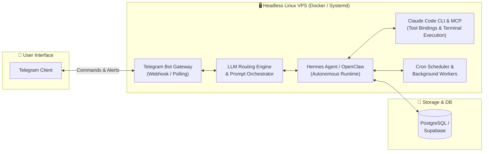

  <!-- Header Banner / Typing SVG -->
  

  

    
    
    
    
  

  

    
  

---

### ⚡ About Me

Software Developer & AI Automation Practitioner focusing on **Agentic AI Architectures**, autonomous runtime systems, and full-stack development pipelines:

- 🤖 **Autonomous AI Systems:** Running 24/7 unattended agents (**Hermes Agent**, **OpenClaw**) on headless Linux VPS with automated Telegram gateways and cronjob routines.
- 💻 **Modern Development:** Vibe coding & spec-driven workflows using **Claude Code CLI**, **Cursor**, and **Model Context Protocol (MCP)** for automated code review & refactoring.
- 🗄️ **Data & Backend:** Production data pipelines, web scrapers (2,000+ dataset extraction), NLP sentiment classification, and relational databases (**PostgreSQL / Supabase**).
- 🚀 **DevOps & Infrastructure:** Linux server hardening, Nginx reverse proxy, SSL automated lifecycle, Docker containerization, and GitHub Actions CI/CD.

---

### 🛠️ Core Tech Stack

  #### Languages & Frameworks
  

   

  #### AI, Agentic & Development Tooling
  

   

  #### Databases, Storage & Cloud Services
  

 

<b>🔍 Detailed Competency Breakdown</b>

 

| Domain | Tools & Technologies |
| :--- | :--- |
| **Agentic AI & LLMs** | Hermes Agent, OpenClaw, Claude Code CLI, Cursor, Prompt Engineering, RAG & Vector Search, MCP Bindings |
| **Backend & Databases** | Python (FastAPI/Flask), Node.js, PostgreSQL, Supabase, SQLite, RESTful APIs, Spec-Driven Development |
| **Data & Machine Learning** | Web Scraping Pipelines, Data Cleaning, Indonesian NLP Stemming, Naive Bayes, Random Forest |
| **Infrastructure & DevOps** | Linux VPS, Docker Containerization, Nginx, Bash Scripting, Cron Orchestration, GitHub Actions |

---

### 🏗️ Architecture: Autonomous Agent & Gateway Pipeline

Visual overview of unattended agent server architecture running on production VPS:

---

### 🚀 Featured Projects

<table>
  <tr>
    <td width="50%">
      <h3 align="center">🤖 Autonomous AI Agent Server</h3>
      

        
        
      

      
Unattended 24/7 autonomous AI agent server with zero GUI overhead. Features custom tool bindings, cron execution, Telegram alerts, and Claude Code CLI integration via MCP.

    </td>
    <td width="50%">
      <h3 align="center">📊 NLP E-Commerce Sentiment Engine</h3>
      

        
        
      

      
Automated pipeline scraping 2,000+ customer reviews across 20 stores. Implemented Indonesian text preprocessing, stemming, and evaluated Naive Bayes vs Random Forest classifiers.

    </td>
  </tr>
  <tr>
    <td width="50%">
      <h3 align="center">🏭 BSM Production Tracking & ERP</h3>
      

        
        
      

      
Internal monitoring system tracking POs, production workflow, and shipment timelines. Synchronized ERP modules with logistics data to eliminate cross-department discrepancies.

    </td>
    <td width="50%">
      <h3 align="center">🌐 Full-Stack Web & VPS Infra</h3>
      

        
        
      

      
Production web services and client deployments backed by hardened Linux VPS instances, automated SSL certificates, and Dockerized service containers.

    </td>
  </tr>
</table>

---

### 📈 GitHub Metrics

  
  
   
  

---

### 📜 Certifications & Education

- 🎓 **Bachelor of Information Systems (S.Kom)** — Universitas Islam Nahdlatul Ulama (UNISNU) Jepara *(2021 – 2025/2026)*
- ☁️ **Dasar Cloud & Gen AI di AWS** — *Dicoding (2026)*
- 📐 **Spec-Driven Development dengan Kiro** — *Dicoding (2026)*
- 📊 **Fundamental Pemrosesan Data** — *Dicoding (2026)*
- 🗄️ **Structured Query Language (SQL)** — *Dicoding (2024)*
- 🔬 **Data Science Certification** — *Dicoding (2024)*
- 💼 **Data Scientist Professional** — *Skill Academy (2024)*

---

  

